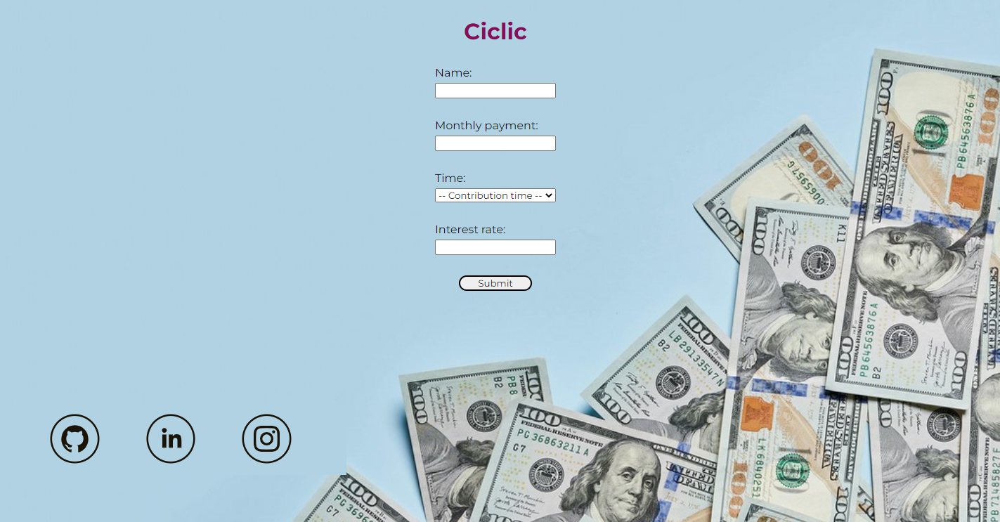
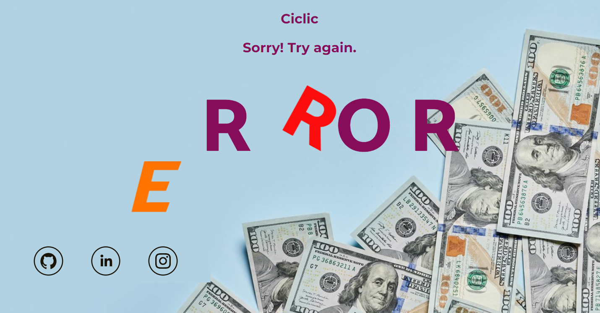
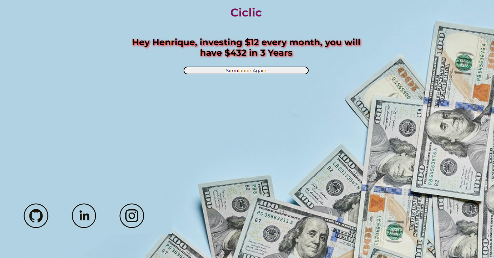

# Leia em:  -- Português --

<h1 align="center">
    
</h1>

 <a href="#-sobre-o-projeto">Sobre</a> •
 <a href="#-funcionalidades">Funcionalidades</a> •
 <a href="#-tecnologias">Tecnologias</a> •
 <a href="#-autor">Autor</a> •

## 💻 Sobre o projeto

💻 Juros Compostos - Faça uma simulação de juros compostos, veja em <a href="#-funcionalidades">Funcionalidades</a> como funciona!

---

## ⚙️ Funcionalidades

- [x] Página inicial:
    <h1 align="center">
        
    </h1>

- [x] Caso de erro:
    <h1 align="center">
        
    </h1>

- [x] Mostrando o resultado:
    <h1 align="center">
        
    </h1>

---

## 🛠 Tecnologias

A seguinte ferramenta foi usada na construção do projeto:

- **[HTML](https://developer.mozilla.org/pt-BR/docs/Web/HTML)**
- **[CSS](https://developer.mozilla.org/pt-BR/docs/Web/CSS)**
- **[SASS](https://sass-lang.com/)**
- **[JavaScript](https://www.javascript.com/)**

## 🦸 Autor

 
  
 <b>Henrique M. Kronhardt</b></a>
  

---

Feito com ❤️ por Henrique M. Kronhardt 👋🏽 [Entre em contato!](https://www.linkedin.com/in/henriquekronhardt/)

# Read in:  -- English --

 <a href="#-about-the-project">About</a> •
 <a href="#-features">Features</a> •
 <a href="#-technologies">Technologies</a> •
 <a href="#-author">Author</a> •

## 💻 About the project

💻 Compound Interest - Do a compound interest simulation, see in <a href="#-features">Features</a> how it works!

---

## ⚙️ Features

- [x] Home page:
    <h1 align="center">
        
    </h1>

- [x] Message error:
    <h1 align="center">
        
    </h1>

- [x] Result after simulation:
    <h1 align="center">
        
    </h1>

---

## 🛠 Technologies

The following tool was used in building the project:

- **[HTML](https://developer.mozilla.org/pt-BR/docs/Web/HTML)**
- **[CSS](https://developer.mozilla.org/pt-BR/docs/Web/CSS)**
- **[SASS](https://sass-lang.com/)**
- **[JavaScript](https://www.javascript.com/)**

## Author

 
  
 <b>Henrique M. Kronhardt</b></a>
  

---

Made with ❤️ by Henrique M. Kronhardt 👋🏽 [Get in touch!](https://www.linkedin.com/in/henriquekronhardt/)
